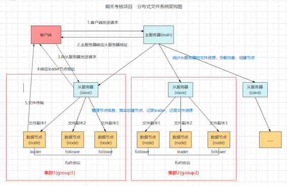
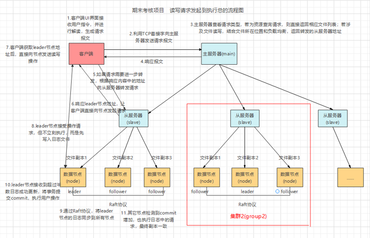

# 基于raft一致性协议的分布式文件系统
raft协议的实现参考了原论文：Diego Ongaro and John Ousterhout. In Search of an Understandable Consensus Algorithm. Stanford University. 2014.    
文章链接：[https://web.stanford.edu/~ouster/cgi-bin/papers/raft-atc14]    
raft协议的过程可参考：Raft Github pages：[https://link.zhihu.com/?target=https%3A//raft.github.io/]     

## 整体架构图

## 以文件写操作为例，系统的工作流程
